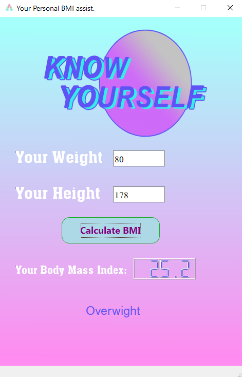
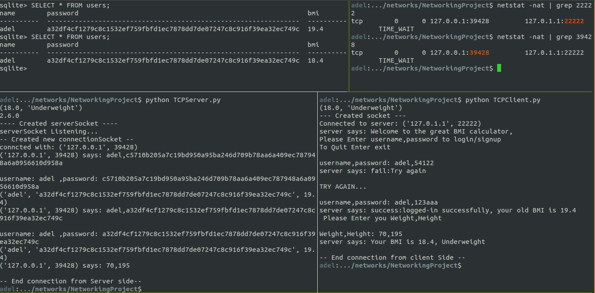
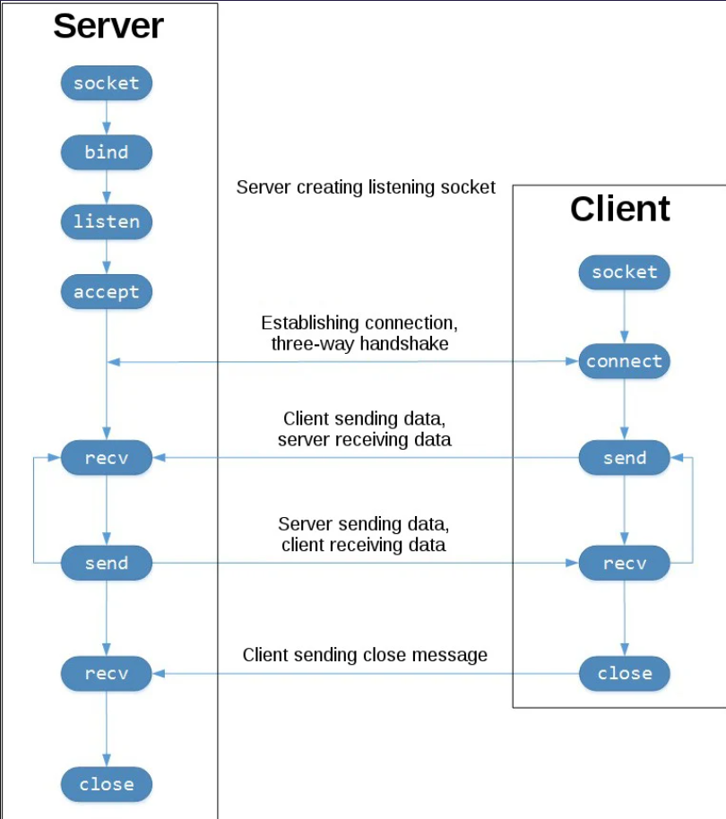

# Server-Client BMI calculator App 
This is a project for the classwork of computer networking class.

**Team Members**
| name                   | section | BN |
|------------------------|---------|----|
| Eslam Khaled Korany    | 1       | 13 |
| Mahmoud Abd AlMoneem   | 2       | 26 |
| Adel Refat Ali         | 2       | 2  |
| Ahmad Adel Muhammad    | 1       | 7  | 
### Snippets From Application UI

### Screen Shot of the protocol chatLoop in action showing the database content and the socket states after the session is completed

## features and techs used
1. socket programming (TCP)
2. Handlling MultiClient Server Communication
3. sqllite for database management
4. simple user account logging and password storage security  
## Usage 
First make sure you have requirements `pip install -r requirements.txt`

Then on the CLI run the server code `python MCTCPServer.py`
At another terminal run the client code `python UI_Manager.py`
## Sequence of Sockets Communication
